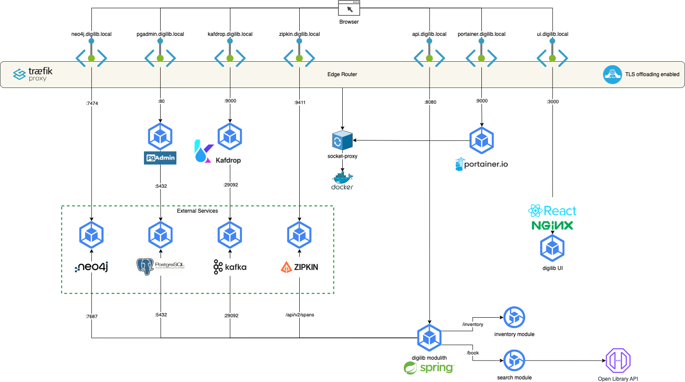

= Digital Library

This project implements a basic digital library with searching books via ISBN and inventory management (add/delete book) functions using https://spring.io/projects/spring-modulith[Spring Modulith, window=_blank] and ReactJS. This application uses https://openlibrary.org/[Open Library, window=_blank] as book info database.

== Architecture

The project is compatible with docker and comprises of modules and services that underpins a typical Spring Modulith based application:

=== Traefik

Serves as edge router for docker-compose setup.

=== Neo4J

Serves as event registry for digilib modulith. It includes *Neo4J browser* for data browsing on graph DB.

=== Kafka

Serves as message broker for event externalization. *Kafdrop* is used as event browser.

=== PostgreSQL

Serves as relational database to store book inventory. *PgAdmin* is used as DB viewer.

=== Zipkin

Is used to capture and view micrometer spans originated by digilib modulith for telemetry and tracing.

== Start-up Modes

The project comes with two different modes based on docker-compose:
* One for link:./docker/docker-compose.yml[development] to activate mandatory external services for development with opening required ports for IDE,
* The other one for link:./docker/docker-compose.yml[production] complementing previous one with serving full-stack application inside docker-compose setup.

The link:./docker/start.sh[start script] (based on `zsh`) has the following options:

[source,shell]
----
start.sh -h
----

[source,text]
----
Start script for digilib app

Syntax: start.sh [-h|p|d]
options:
h     Prints this Help.
p     Start in production mode.
d     Start in developer mode.
u     Uninstall setup.
----

The start script also generates and registers a self-signed certificate to enable TLS on Traefik edge router.